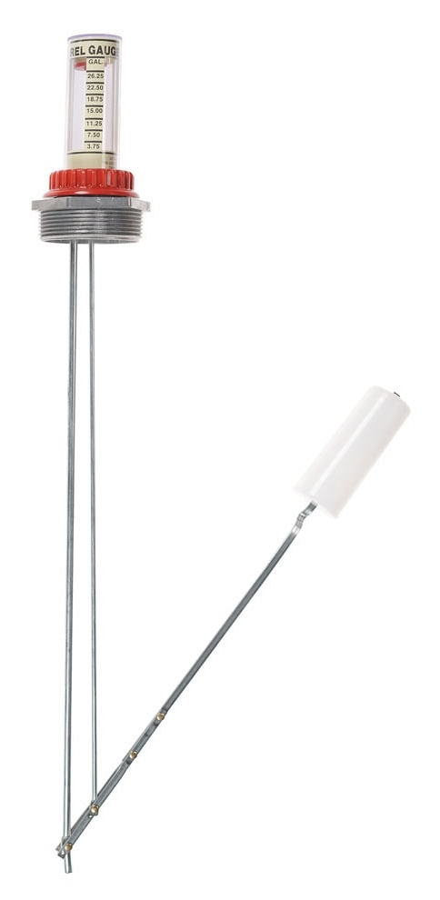
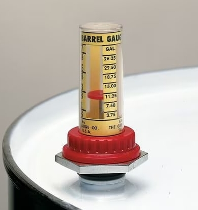
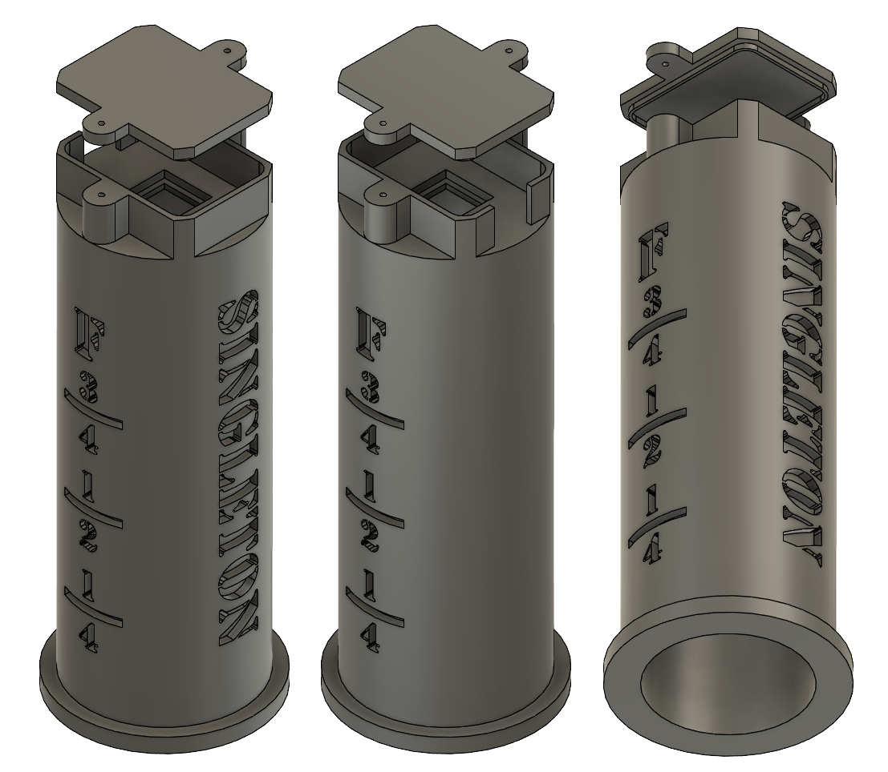

# Well Pump Controller <!-- omit from toc -->

This an Arduino project that automates pumping well water for irrigation use.

## Contents <!-- omit from toc -->

- [Description](#description)
- [Components](#components)
- [Objective](#objective)
- [Motivation](#motivation)
- [Obstacles](#obstacles)
    - [Wells Are Inconsistent](#wells-are-inconsistent)
    - [Measuring Flow](#measuring-flow)
- [3D Printed Gauge Head](#3d-printed-gauge-head)
- [Design Negatives](#design-negatives)
    - [Gauge Error](#gauge-error)
    - [Gauge is Short](#gauge-is-short)
    - [High Barrel Inlet](#high-barrel-inlet)
    - [Wet Electronics](#wet-electronics)
- [Design Positives](#design-positives)
    - [Cost](#cost)
    - [Sensor is Arduino Compatible](#sensor-is-arduino-compatible)
    - [Simple](#simple)
    - [Can be Simulated without Water](#can-be-simulated-without-water)
- [Redesign](#redesign)
- [Flow Rate Optimization Algorithm](#flow-rate-optimization-algorithm)

## Description

Utah has been in a drought for many years and irrigation water has been limited
by the city where my grandfather lives. After doing some work in the yard, he
discovered where an old well used to be. He redug the well and discovered that
it still had a good supply of water. He repeated this in a few other spots on
the property and found more water. The wells are about 8-10 feet deep and end
where the water saturates coarse sand. As far as wells go, they are very small
and inexpensive. Nonetheless, this water is free could save his plants over the
hot summer.

To use the well water, he pumps water into small barrels, moves the barrels
around the yard on a wagon and then waters the plants. This is a lot of manual
work in the sun for my grandpa so we want to make the wells work with his
existing irrigation system. For this, water needs to be pumped out
of the wells, stored in a reservoir, and then pumped into the irrigation
system. The end goal is to have the well and irrigation work together
and be fully automated.

## Components

- Well
- Well Pump
- Pipe and Fittings
- 55 Gallon Barrel
- 55 Gallon Barrel Lid with 2" Bung
- [55 Gallon Barrel Level Gauge](https://www.zoro.com/at-a-glance-barrel-level-gauge-55-gal-2-in-npt-b-55-2/i/G3385846/)
- [Arduino UNO WiFi Rev.2](https://store-usa.arduino.cc/products/arduino-uno-wifi-rev2?selectedStore=us)
- [Adafruit VL6180X Time of Flight Distance Ranging Sensor (VL6180)](https://www.adafruit.com/product/3316)
- [STEMMA QT Adapter Cables](https://www.adafruit.com/product/4209)

## Objective

Create a controller for the well pump so that the water reservoir is
automatically filled.

## Motivation

Getting the many gallons needed to irrigate the yard is time consuming and
highly variable due to the nature of the shallow wells. Simpler methods of
controlling the pump have some significant drawbacks that can be remediated
with more the complex logic of a microcontroller.

## Obstacles

### Wells Are Inconsistent

The wells only have so much water that can be pumped at a time. The sand loses
water faster than it can be replenished and eventually it runs dry. Then, some
time is needed for the sand to become saturated again. The run and wait times
differ for each well and change throughout the year. So to automate the
irrigation system, we need to account for and, ideally, optimize these times
intervals. Otherwise, the pump could run dry and/or the irrigation system could
be starved of water. This Arduino project control the pump to solve these
issues.

Inconsistency means that the irrigation system cannot be directly supplied by
the wells. It may take a hours of pumping and waiting to get enough water to
run the irrigation system for ten minutes. Irrigation systems are designed to
run with a constant flow at a consistent pressure, which wouldn't be possible.
This is why a reservoir is needed. With a pump connected to the reservoir, we
can control flow and pressure to mimic water coming from the city. Also, if we
know how much water is in the reservoir, we can make sure that the irrigation
system doesn't use too much at once. We had a 55 gallon drum laying around that
became our reservoir.

### Measuring Flow

When the wells are run by a person, they can see how much water is coming out
of the well and determine when to turn it off as the flow slows. To automate
this system, the Arduino needs to be able to measure this flow rate. With this
information, the software can determine when to turn off the pump and track how
much water has flown into the reservoir.

There are many ways to measure the flow of water. First thought would be to use
a standard water flow meter that gets connected between the pump and the
reservoir, however due to the spurting nature of the well pump it wouldn't read
accurately. Plus they can be hundreds of dollars.

Another thought was to measure the weight of the reservoir barrel. This would
be very accurate but scales that large can be 1-2 thousand dollars. Not only
that, but this limits us to one barrel and takes up more square footage.

## 3D Printed Gauge Head

We ended modifying a barrel level gauge to accommodate a small distance
sensor. This made it possible to digitize the mechanical float gauge so the
Arduino could determine the water level.

**Float gauge**:

**Gauge head**:

My brother designed and 3D printed a plastic housing that goes around the red
level-indicator. This new housing holds the distance sensory where it can
measure the red disk moving up and down. It was printed clear so that it didn't
lose any existing functionality.

**Printed Housing**:

## Design Negatives

### Gauge Error

After we mocked up the system, I realized that measuring the very small
distance that the level gauge moved massively decreases the accuracy of
measuring flow. From zero to full, the gauge moves about 56 mm. That's about a
14x reduction in resolution from a directly measuring the barrel. On top of
that, the gauge easily bobs up and down slightly and introduces error that has
to be accounted for. This error ends up being nearly +/- one gallon, which is a
lot when it comes to water flow out of 3.4" pipe. This makes impossible to
reliably determine small, but meaningful changes in the flow rate.

### Gauge is Short

The lever arm that floats in the barrel needs to be able to swing up and down
without hitting the walls of the barrel. This limits how long the arm can be,
so the float doesn't actually reach the very top or bottom of the barrel.
Essentially making the completely full and empty zones unmeasurable.

### High Barrel Inlet

Well water flows into the barrel from the 3/4" hole in the lid, which creates a
lot of turbulence in the water and introduces more float gauge error.

### Wet Electronics

With the current design, the Arduino and sensor are together atop of the
barrel. This leaves both of them in the potential splash zone and very exposed
to the elements as the barrel will be stored outside.

## Design Positives

### Cost

With the cost of the distance sensor being around $15, it is by far the
cheapest option that we have come up with. This is important because my
grandfather stresses about the project becoming expensive and makes replacing
damaged electronics less concerning.

### Sensor is Arduino Compatible

Using a sensor from Adafruit means that it is plug and play with the Arduino.
We don't have do the work of making some other piece of hardware communicate
with the Arduino somehow. This reduces a lot of potential problems and
headache.

### Simple

After some initial measurements, unit conversions and calculating flow rate
wasn't too complicated.

### Can be Simulated without Water

Using a flow meter or a scale would require using water to get measurements to
the Arduino. This would have made testing and troubleshooting take much longer
and waste a lot of water. With the distance sensor, I can use my hand to test
values.

## Redesign

To fix the issues with the float gauge, I plan on using a 3" pipe with a
floating puck to measure distance. The puck can float all of the way up and
down, and the reading from the sensory will 1:1. The puck can be 3D printed
with an end cap for the pip so it cannot escape. Also, water will fill from the
bottom of the tank to keep the puck from bobbing.

Additionally, I can store the Arduino inside if I use a small communication
board that lives on the barrel with the sensor. This keeps the Arduino safe and
waterproofing smaller components is easier.

## Flow Rate Optimization Algorithm

Since the flow rate accuracy was much lower than expected, I only wrote a simple
well controller. It does the proper conversions and has a simple on/off logic.

My original objective was to write a an algorithm that optimizes the amount of
water per 24 hour period. With some sudo randomness to account for the ever
changing well conditions, this would be pretty simple to do.
